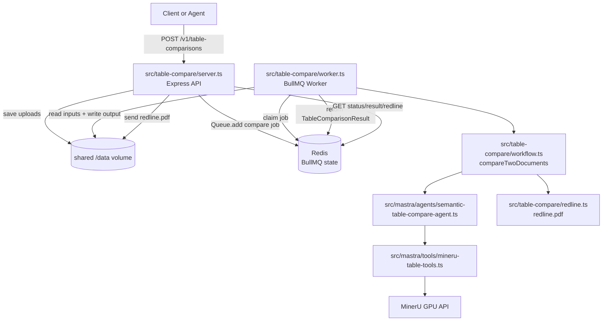
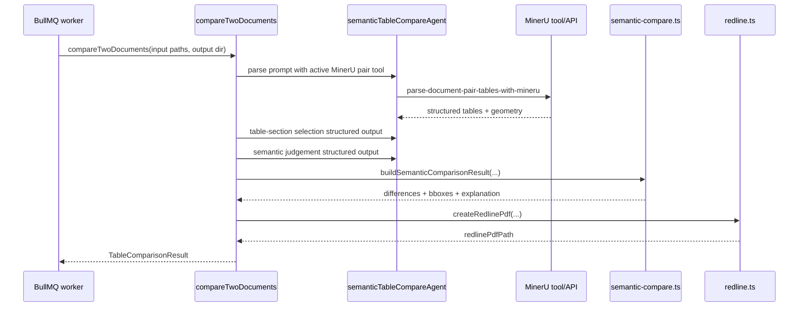

# BullMQ/Redis Table Compare Microservice

This document describes the table-comparison service after moving job execution out of process memory and into BullMQ backed by Redis.

The important change is that the HTTP API no longer owns an in-memory worker loop. The API persists uploads, enqueues a BullMQ job, and returns immediately. A separate worker container consumes that queue and runs the existing MinerU + Mastra semantic comparison workflow.

## Service Shape



## Containers

`docker-compose.yml` now runs these table-comparison services:

- `redis`: Redis 7 with append-only persistence enabled. It is internal to the Compose network and is not published on the host.
- `table-agent`: the HTTP API on port `8090`.
- `table-worker`: the BullMQ worker process. It uses the same image as `table-agent`, but starts `npm run worker:table-agent`.
- `mineru`: GPU-backed MinerU parsing service.
- `gotenberg`: fixture/test PDF and image generation service.

Both `table-agent` and `table-worker` mount `./data:/data`, so the API can save uploaded files and the worker can read them later. The worker also writes `result.json`, geometry artifacts, and `redline.pdf` into that shared volume.

## Queue Configuration

### `src/table-compare/queue.ts`

This file centralizes queue settings:

- `queueName()` reads `TABLE_COMPARE_QUEUE_NAME`, defaulting to `table-comparisons`.
- `redisConnectionOptions()` reads `REDIS_URL`, defaulting to `redis://127.0.0.1:6379`.

BullMQ creates its own Redis client from those options. We intentionally do not keep a separate top-level `ioredis` dependency.

## API Process

### `src/table-compare/server.ts`

The API process initializes:

- `MinerUClient`, used only for `/health`;
- `TableCompareJobManager`, used to create/read BullMQ jobs;
- Swagger UI at `/docs`;
- OpenAPI JSON at `/openapi.json` and `/swagger.json`;
- the async table-comparison routes.

### `POST /v1/table-comparisons`

The upload route does the following:

1. `multer` reads multipart fields `documentA` and `documentB`.
2. `parseBaselineDocument(...)` validates optional `baselineDocument`.
3. `jobs.submit(...)` persists both uploads under:

   ```text
   /data/table-compare/jobs/<job_id>/input/
   ```

4. `jobs.submit(...)` enqueues a BullMQ job named `compare`.
5. The route returns `202 Accepted` with:

   - `jobId`
   - `statusUrl`
   - `resultUrl`
   - `redlinePdfUrl`

The route never waits for MinerU, Mastra, or redline generation.

### Polling Routes

`server.ts` uses `jobs.get(jobId)` for all polling endpoints:

- `GET /v1/table-comparisons/:jobId`
- `GET /v1/table-comparisons/:jobId/result`
- `GET /v1/table-comparisons/:jobId/redline.pdf`

`jobs.get(...)` reads the BullMQ job from Redis using `Job.fromId(...)`, maps BullMQ states to API states, and returns a `CompareJobRecord`.

BullMQ state mapping:

- `waiting`, `delayed`, `prioritized`, `paused` -> `queued`
- `active` -> `processing`
- `completed` -> `completed`
- `failed` -> `failed`

## Job Manager

### `src/table-compare/job-manager.ts`

`TableCompareJobManager` no longer stores jobs in an in-memory `Map` and no longer runs work itself.

It now owns a typed BullMQ queue:

```ts
Queue<TableCompareJobData, TableComparisonResult, "compare">
```

### `submit(...)`

`submit(...)` is responsible for durable job setup:

1. Create a stable id with `randomUUID().replaceAll("-", "")`.
2. Create input and output directories:

   ```text
   /data/table-compare/jobs/<job_id>/input/
   /data/table-compare/jobs/<job_id>/output/
   ```

3. Write uploaded buffers to disk.
4. Build `TableCompareJobData` containing:

   - job id;
   - stored file names;
   - absolute input paths;
   - output directory;
   - optional baseline document;
   - creation timestamp.

5. Call:

   ```ts
   queue.add("compare", data, { jobId: id })
   ```

6. Return a queued `CompareJobRecord` to `server.ts`.

### `get(...)`

`get(id)` loads the job from Redis/BullMQ and reconstructs API-facing metadata:

- timestamps from BullMQ `timestamp`, `processedOn`, and `finishedOn`;
- failure reason from `job.failedReason`;
- result from `job.returnvalue` when completed.

### `counts()`

`counts()` calls `queue.getJobCounts(...)` and converts BullMQ buckets into API buckets. `/health` exposes those counts.

## Worker Process

### `src/table-compare/worker.ts`

The worker starts a BullMQ `Worker<TableCompareJobData, TableComparisonResult, "compare">`.

The worker concurrency comes from:

```text
TABLE_COMPARE_WORKER_CONCURRENCY
WORKER_CONCURRENCY
default: 2
```

The processor function does this for each job:

1. `job.updateProgress({ stage: "running-workflow" })`
2. Ensure the output directory exists.
3. Call `compareTwoDocuments(...)` from `src/table-compare/workflow.ts`.
4. Write a filesystem copy of the result to:

   ```text
   /data/table-compare/jobs/<job_id>/output/result.json
   ```

5. Return the full `TableComparisonResult` to BullMQ.

BullMQ stores the return value in Redis, which is what the API returns from `GET /result`.

The worker also logs completion and failure events. If the worker crashes mid-job, BullMQ keeps the job state in Redis rather than losing it inside an API process.

## Existing Comparison Workflow

The queue refactor does not change the core comparison pipeline.

`src/table-compare/workflow.ts` still owns the job body:



The Mastra agent still must ground the comparison in MinerU structured output. The worker just provides a durable execution boundary around that existing workflow.

## Semantic Resilience Added During This Refactor

While running the full suite through BullMQ, the infrastructure worked but the semantic model produced nondeterministic plans for same-content manufacturing templates. The plans were structurally valid, but sometimes over-reported template-only differences.

`src/table-compare/semantic-compare.ts` now performs deterministic post-processing before producing the API result:

- ignores blank/padding row differences;
- ignores one-sided computed summary rows such as `TOTAL`/`Subtotal` when represented as added/removed rows;
- ignores optional template-only remarks/notes/comments when one side is blank and the other side is a generic placeholder such as `line note`;
- keeps real non-generic notes as material differences;
- keeps total value differences when both documents expose comparable total cells.

This is deliberately after the agent step. The agent still performs semantic matching, but deterministic code prevents known template artifacts from flipping `different` to `true`.

Unit coverage for this behavior lives in `scripts/test_table_compare_unit.ts`.

## Result Storage

There are two result locations:

- Redis/BullMQ stores the completed job return value for API retrieval.
- The shared filesystem stores artifacts:

  ```text
  /data/table-compare/jobs/<job_id>/output/result.json
  /data/table-compare/jobs/<job_id>/output/redline.pdf
  ```

The redline endpoint uses the `redlinePdfPath` inside the completed result and sends that file from disk.

## Failure Behavior

Failure flow:

1. The worker throws during parsing, agent judgement, redline creation, or filesystem writes.
2. BullMQ marks the job `failed`.
3. `job.failedReason` becomes the API `error`.
4. `GET /result` and `GET /redline.pdf` return `409`.

The API process does not need to be alive while the worker executes a job. As long as Redis and the shared data volume survive, another API process can read status/result metadata for completed jobs.

## Concurrency

There are two relevant concurrency limits:

- `TABLE_COMPARE_WORKER_CONCURRENCY`: BullMQ jobs processed by `table-worker` at once.
- `MINERU_API_MAX_CONCURRENT_REQUESTS`: MinerU parse tasks processed at once.

One comparison job can parse two documents, so increasing worker concurrency increases pressure on MinerU and the GPU. The current Compose default is `4`, matching the current MinerU concurrency setting.

## Verification

After the refactor, these passed against the Dockerized Redis/BullMQ stack:

```bash
npm run typecheck
npm run test:table-unit
npm run test:table-semantic-e2e
npm run generate:table-fixtures
npm run test:table-e2e
npm run test:table-manufacturing-e2e
```

The manufacturing suite passed all 25 cases, including:

- same content with reordered rows;
- different templates with same content;
- optional remarks/style noise;
- one-sided blank padding;
- real quantity, unit price, amount, material code, spec, order number, date, and total changes;
- PNG input;
- image-PDF input;
- eight-line table cases.
