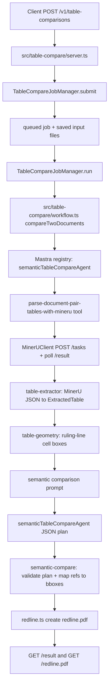

# Codebase Guide: MinerU Table Comparison Agent

This document describes the table comparison system as it stands now. It follows one full request from the HTTP API, through the async job queue, into the Mastra semantic agent, through MinerU parsing, semantic comparison, and redline PDF generation.

The older outer `tableCompareAgent` path has been removed. The API now talks directly to `semanticTableCompareAgent`.

## High-Level Shape



## Runtime Services

### `docker-compose.yml`

The table comparison path runs mainly through two services:

- `mineru`: GPU-backed MinerU API container.
- `table-agent`: Node/Mastra async API for table comparison.

Important `mineru` settings:

- `gpus: all`
- `MINERU_DEVICE_MODE=cuda`
- `MINERU_API_MAX_CONCURRENT_REQUESTS`
- `MINERU_PROCESSING_WINDOW_SIZE`

Important `table-agent` settings:

- `MINERU_BASE_URL=http://mineru:8000`
- `TABLE_COMPARE_STORAGE_ROOT=/data`
- `TABLE_COMPARE_WORKER_CONCURRENCY`
- `MASTRA_MODEL`
- `ANTHROPIC_API_KEY` / `ANTHROPIC_AUTH_TOKEN`

### `docker/mastra-agent.Dockerfile`

Builds the Node service for table comparison:

- starts from `node:24-slim`;
- installs `poppler-utils`, used by `pdftoppm` for PDF page rendering;
- runs `npm ci`;
- copies `src`;
- starts `npm run dev:table-agent`, which runs `tsx src/table-compare/server.ts`.

## Server Initialization

### `src/table-compare/server.ts`

This is the HTTP entrypoint for the table comparison API.

At module load time it initializes:

- `port` from `TABLE_COMPARE_PORT`, default `8090`;
- `storageRoot` from `TABLE_COMPARE_STORAGE_ROOT` or `STORAGE_ROOT`, default `/data`;
- `mineruBaseUrl` from `MINERU_BASE_URL`, default `http://127.0.0.1:8000`;
- worker concurrency from `TABLE_COMPARE_WORKER_CONCURRENCY` or `WORKER_CONCURRENCY`, default `2`;
- `multer` memory upload handling with `MAX_UPLOAD_BYTES`;
- a `MinerUClient` for health checks;
- a `TableCompareJobManager` for async job state and execution;
- an Express app.

The server starts at the bottom of the file:

```ts
app.listen(port, () => {
  console.log(`table comparison API listening on :${port}`);
});
```

## HTTP API

### `GET /health`

Defined in `server.ts`.

This calls `mineru.health()` through `MinerUClient.health()` and returns:

- table-agent health;
- MinerU health/version/status;
- job counts from `jobs.counts()`;
- configured worker concurrency.

### `POST /v1/table-comparisons`

Defined in `server.ts`.

This is the main request entrypoint. It expects multipart fields:

- `documentA`
- `documentB`
- optional `baselineDocument` or `baseline`, value `documentA` or `documentB`

The route does the following:

1. Uses `upload.fields(...)` from `multer` to accept two uploaded files in memory.
2. Validates both documents exist.
3. Calls `parseBaselineDocument(...)` to validate the optional baseline.
4. Calls `jobs.submit({ documentA, documentB, baselineDocument })`.
5. Returns `202 Accepted` immediately with:
   - `jobId`
   - status URL
   - result URL
   - redline PDF URL

The request does not wait for MinerU or the model.

### `GET /v1/table-comparisons/:jobId`

Defined in `server.ts`.

This calls `jobs.get(jobId)` and returns serialized job state via `serializeJob(...)`.

### `GET /v1/table-comparisons/:jobId/result`

Defined in `server.ts`.

Behavior:

- `202` if queued or processing;
- `409` if failed;
- full `TableComparisonResult` JSON when completed.

### `GET /v1/table-comparisons/:jobId/redline.pdf`

Defined in `server.ts`.

Behavior:

- `202` if the redline is not ready;
- `409` if the job failed;
- sends `job.result.redlinePdfPath` once completed.

## Job Creation And Queueing

### `src/table-compare/job-manager.ts`

The class is `TableCompareJobManager`.

It owns:

- `jobs`: in-memory `Map<string, CompareJobRecord>`;
- `queue`: pending jobs;
- `active`: current worker count;
- configured `concurrency`.

### `TableCompareJobManager.submit(...)`

Called by `server.ts` from `POST /v1/table-comparisons`.

Responsibilities:

1. Creates a job id using `randomUUID().replaceAll("-", "")`.
2. Creates an input directory:

   ```text
   <storageRoot>/table-compare/input/<job_id>/
   ```

3. Sanitizes upload names with `safeName(...)`.
4. Writes both uploaded buffers to disk.
5. Builds a `CompareJobRecord` with:
   - id;
   - status `queued`;
   - original stored filenames;
   - absolute input paths;
   - optional baseline document;
   - timestamps.
6. Stores the record in `jobs`.
7. Pushes the record into `queue`.
8. Calls `drain()`.
9. Returns the job immediately to the HTTP route.

### `TableCompareJobManager.drain()`

Starts queued work while `active < concurrency`.

For each job it:

- removes one queued record;
- increments `active`;
- calls `run(record)` asynchronously;
- decrements `active` when finished;
- calls `drain()` again to continue processing the queue.

### `TableCompareJobManager.run(record)`

This is the background worker for one comparison.

Responsibilities:

1. Marks the job `processing`.
2. Creates an output directory:

   ```text
   <storageRoot>/table-compare/results/<job_id>/
   ```

3. Calls `compareTwoDocuments(...)` from `src/table-compare/workflow.ts`.
4. Stores the returned `TableComparisonResult` on `record.result`.
5. Marks the job `completed`, or `failed` with an error string.
6. Updates timestamps.

## API-To-Agent Workflow

### `src/table-compare/workflow.ts`

This file is the bridge between the async API/job system and Mastra.

The main exported function is:

```ts
compareTwoDocuments(input: CompareTwoDocumentsInput): Promise<TableComparisonResult>
```

The input contains:

- `documentAPath`
- `documentBPath`
- `outputDirectory`
- optional `baselineDocument`

### `compareTwoDocuments(...)`

This is the core orchestration function for a job.

Step by step:

1. Retrieves the Mastra agent:

   ```ts
   const agent = mastra.getAgent("semanticTableCompareAgent");
   ```

2. Defaults `baselineDocument` to `documentB`.
3. Calls `parseDocumentsWithSemanticAgent(agent, input)`.
4. Fails if either parsed document has no tables.
5. Selects the first table from each document:

   ```ts
   const tableA = parsed.documentA.tables[0];
   const tableB = parsed.documentB.tables[0];
   ```

6. Calls `buildSemanticComparisonPrompt(tableA, tableB, baselineDocument)`.
7. Calls `runSemanticJudgement(agent, prompt, tableA, tableB)`.
8. Converts the agent JSON plan into a typed `TableComparisonResult` with `buildSemanticComparisonResult(...)`.
9. Chooses the baseline file path for redlining.
10. Calls `createRedlinePdf(...)`.
11. Returns the full comparison result plus agent metadata:

   ```json
   {
     "id": "semantic-table-compare-agent",
     "registryName": "semanticTableCompareAgent",
     "skill": "compare-two-tables",
     "toolCalls": [
       "parse-document-pair-tables-with-mineru",
       "semantic-table-compare-agent",
       "create-table-redline-pdf"
     ],
     "invokedByApi": true
   }
   ```

### `parseDocumentsWithSemanticAgent(...)`

This function forces the request through the Mastra agent and the MinerU tool.

It builds a prompt instructing the agent to call:

```text
parse-document-pair-tables-with-mineru
```

with exact arguments:

- `documentAPath`
- `documentBPath`
- `documentAName`
- `documentBName`
- `geometryWorkDirA`
- `geometryWorkDirB`

The call to `agent.generate(...)` restricts active tools:

```ts
activeTools: ["parseDocumentPairTablesTool"]
```

This means the agent can call the pair parsing tool, but not arbitrary tools.

`onStepFinish` calls `extractParsePairToolResult(step)` to capture the tool output. After generation finishes, the function checks that the extracted output has both:

- `documentA`
- `documentB`

If not, the job fails with:

```text
semanticTableCompareAgent did not parse both documents with MinerU
```

Why the pair tool exists:

- Earlier two independent parse calls could let the model accidentally parse the same document twice.
- The pair tool keeps the agent in the loop while making document A/B binding deterministic.
- Internally the pair tool still parses both documents concurrently.

### `runSemanticJudgement(...)`

This function asks the same semantic agent to make the final comparison decision.

It calls:

```ts
agent.generate(prompt, {
  activeTools: [],
  modelSettings: { temperature: 0, maxOutputTokens: 4096 },
})
```

Important detail: `activeTools: []` means the model is not allowed to call tools during the judgement phase. At this point it must reason from the structured MinerU evidence in the prompt.

Then it:

1. Reads `response.text`.
2. Calls `parseSemanticPlanOrRepair(...)`.
3. Calls `reviewSameFormatCandidates(...)`.
4. Returns the final `SemanticComparisonPlan` and final agent response text.

### `parseSemanticPlanOrRepair(...)`

The semantic agent must return JSON matching `semanticComparisonPlanSchema`.

This function:

1. Attempts to parse the response with `parseSemanticComparisonPlanText(...)`.
2. If parsing fails, asks the same agent to repair the JSON.
3. Allows up to three attempts.
4. Requires strict JSON: no comments, no trailing commas, quoted property names.

### `reviewSameFormatCandidates(...)`

This is a guardrail for same-format tables.

If both tables have the same row count and column count, and the agent omitted some obvious positional candidate differences, the workflow sends a second review prompt built by:

```ts
buildSameFormatCandidateReviewPrompt(...)
```

This does not replace semantic reasoning with hardcoded comparison. It asks the semantic agent to explicitly review the omitted candidates and either include them or explain why they are formatting-only.

## Mastra Runtime

### `src/mastra/index.ts`

Registers the only API-facing table comparison agent:

```ts
export const mastra = new Mastra({
  agents: { semanticTableCompareAgent },
});
```

There is no longer a separate outer `tableCompareAgent`.

### `src/mastra/model.ts`

`defaultModel()` selects the model string:

1. `MASTRA_MODEL`, if provided.
2. `anthropic/deepseek-v4-flash`, if Anthropic auth env vars exist.
3. `openai/gpt-4o-mini` fallback.

### `src/mastra/agents/semantic-table-compare-agent.ts`

Defines:

```ts
semanticTableCompareAgent
```

Important properties:

- `id`: `semantic-table-compare-agent`
- `name`: `Semantic Table Compare Agent`
- `model`: `defaultModel()`
- `tools`: `{ parseDocumentPairTablesTool }`

The instructions tell the agent:

- call `parse-document-pair-tables-with-mineru` when given document paths;
- use already parsed MinerU table evidence when provided;
- infer row and column matches semantically;
- handle reordered rows, different headers, extra template columns, payable/invoice comparisons, and equivalent part descriptions;
- ignore style/order-only changes;
- report material business-content differences.

## MinerU Tool Layer

### `src/mastra/tools/mineru-table-tools.ts`

This file exposes the Mastra tools and shared helpers for parsing documents with MinerU.

### `parseDocumentPairTablesTool`

Tool id:

```text
parse-document-pair-tables-with-mineru
```

This is the tool used in the current API path.

Its input schema includes:

- `documentAPath`
- `documentBPath`
- optional `documentAName`
- optional `documentBName`
- optional `geometryWorkDirA`
- optional `geometryWorkDirB`

Its `execute` function calls:

```ts
parseDocumentPairTables(...)
```

### `parseDocumentPairTables(...)`

This function creates one shared `MinerUClient`, then parses both documents concurrently:

```ts
const [documentA, documentB] = await Promise.all([...]);
```

Each side calls `parseDocumentTables(...)`.

### `parseDocumentTables(...)`

One-document parsing helper.

Responsibilities:

1. Uses `MinerUClient.parseDocument(filePath)`.
2. Calls `extractTablesFromMinerUResult(...)`.
3. Calls `refineDocumentTablesWithPdfRulingLines(...)`.
4. Returns `ParsedDocumentTables`.

### `parseDocumentTablesTool`

Single-document Mastra tool:

```text
parse-document-tables-with-mineru
```

This remains available as a lower-level tool/helper, but the API comparison path uses the pair tool to avoid document mix-ups.

## MinerU HTTP Client

### `src/table-compare/mineru-client.ts`

The class is `MinerUClient`.

### `MinerUClient.parseDocument(filePath, options)`

This submits one file to MinerU.

It builds multipart form data with:

- file bytes;
- `lang_list`;
- `backend`, default `hybrid-auto-engine`;
- `parse_method`, default `auto`;
- `formula_enable`;
- `table_enable`;
- `image_analysis`;
- `return_md=true`;
- `return_middle_json=true`;
- `return_content_list=true`;
- page range.

Then it:

1. `POST`s to `${baseUrl}/tasks`.
2. Reads `task_id`.
3. Calls `waitForResult(taskId)`.

### `MinerUClient.waitForResult(taskId)`

Polls:

```text
GET /tasks/:taskId
```

until:

- `completed`: fetches `GET /tasks/:taskId/result`;
- `failed`: throws;
- timeout: throws.

### `guessMimeType(fileName)`

Supports:

- PDF
- DOC
- DOCX
- PNG
- JPG/JPEG
- WEBP

This is why the API can accept PDFs, office documents, and images as inputs, assuming MinerU can parse the format.

## Converting MinerU Output Into Tables

### `src/table-compare/table-extractor.ts`

The main exported function is:

```ts
extractTablesFromMinerUResult(rawResult, fileName, mineruTaskId)
```

It converts raw MinerU output into:

```ts
ParsedDocumentTables
```

### What It Reads From MinerU

It reads the first result entry from `rawResult.results`.

From `middle_json`, it extracts:

- page sizes via `extractPages(...)`;
- table body page-space bounding boxes via `extractMiddleJsonTables(...)`.

From `content_list`, it extracts:

- table items where `type === "table"`;
- `table_body` HTML;
- captions;
- fallback table bboxes.

### `buildExtractedTable(...)`

This function creates an `ExtractedTable`:

- table index;
- page index;
- page size;
- table bbox;
- raw table HTML;
- row count;
- column count;
- cells.

Cells are parsed from HTML by `parseTableHtml(...)`.

### `parseTableHtml(...)`

Uses `cheerio` to walk table rows and `th`/`td` cells.

It captures:

- row index;
- column index;
- `rowspan`;
- `colspan`;
- normalized text.

It also assigns spreadsheet-style refs via `cellRef(...)`, for example:

- `A1`
- `B3`
- `D5`

### Initial Cell Geometry

MinerU currently gives reliable table-level boxes, but not true per-cell boxes.

`buildExtractedTable(...)` creates an initial `uniform_grid` geometry by splitting the table bbox by row and column count. This is a fallback, not the preferred precision path.

## Refining Cell Coordinates

### `src/table-compare/table-geometry.ts`

The main exported function is:

```ts
refineDocumentTablesWithPdfRulingLines(documentPath, parsed, workDir)
```

This improves cell bboxes when the input is a PDF or PNG with visible table ruling lines.

### Supported Source Kinds

`sourceDocumentKind(...)` currently recognizes:

- `.pdf`
- `.png`

Other file types keep the extracted uniform-grid geometry.

### PDF Rendering

For PDFs, `renderPdfPage(...)` runs:

```text
pdftoppm -png -f <page> -l <page> -singlefile -r 144
```

The rendered PNG is loaded with `pngjs`.

For PNG input, `loadPngPage(...)` reads the image directly.

### Grid Detection

`detectGrid(...)`:

1. Maps MinerU page-space table bbox to rendered image pixels.
2. Crops around the table area.
3. Finds vertical and horizontal dark-line clusters.
4. Selects the strongest expected number of boundaries:
   - `colCount + 1` vertical boundaries;
   - `rowCount + 1` horizontal boundaries.

Key helpers:

- `findLineClusters(...)`
- `clusterAdjacentScores(...)`
- `summarizeCluster(...)`
- `selectBoundaries(...)`

### Applying The Detected Grid

`applyDetectedGrid(...)` replaces each cell bbox with boundaries from actual detected ruling lines.

If detection succeeds:

```ts
geometrySource: "pdf_ruling_lines"
```

If detection fails:

```ts
geometrySource: "uniform_grid"
```

This is what lets irregular tables with uneven row heights or column widths redline correctly.

## Semantic Comparison

### `src/table-compare/semantic-compare.ts`

This file owns the semantic comparison data contract and prompt construction.

### `semanticComparisonPlanSchema`

Zod schema for the agent JSON plan.

Required top-level fields:

- `different`
- `summary`
- `explanation`
- `differences`

Optional:

- `rowMatches`
- `ignored`

Each difference may include:

- `kind`: `cell_changed`, `row_added`, `row_removed`, or `shape_changed`;
- `cellRefA`;
- `cellRefB`;
- `rowIndexA`;
- `rowIndexB`;
- `field`;
- `before`;
- `after`;
- `explanation`.

### `compactTableForSemanticAgent(table)`

Produces a compact table representation for the prompt:

- `rowCount`
- `colCount`
- rows with `rowIndex`, `isHeader`, and cell refs/text.

This keeps model context focused on structured table evidence rather than raw MinerU output.

### `buildSemanticComparisonPrompt(...)`

Builds the prompt used by `workflow.ts`.

The prompt tells the agent to:

- infer corresponding columns by meaning;
- infer corresponding rows by business content;
- ignore visual style and row/column order;
- ignore non-material extra template columns;
- report material missing/extra columns;
- directly compare same-format/same-order tables;
- include cell refs for redlining;
- return JSON only.

It includes:

- compact Document A table;
- compact Document B table;
- baseline document choice;
- same-grid candidate differences.

### Same-Grid Candidate Differences

`compactCandidateDifferences(...)` calls the legacy exact-grid helper:

```ts
compareFirstTables(tableA, tableB)
```

The result is included as evidence for the semantic agent. It is not the final judgement. This helps catch same-format cell changes while still allowing row reorder and template differences.

### `parseSemanticComparisonPlanText(text)`

Extracts and validates the agent JSON plan.

It supports responses that accidentally include a fenced JSON block by extracting the first `{ ... }` object before schema validation.

### `needsSameFormatCandidateReview(...)`

Determines whether the agent may have missed obvious same-format differences.

It returns true when:

- the tables have the same shape;
- there are candidate positional differences;
- the agent returned fewer differences than the candidates.

### `buildSameFormatCandidateReviewPrompt(...)`

Creates a second-pass prompt asking the agent to review omitted same-grid differences. This is used by `workflow.ts` only when `needsSameFormatCandidateReview(...)` is true.

### `buildSemanticComparisonResult(...)`

Turns the validated agent plan into a `TableComparisonResult`.

It:

- maps cell refs back to `ExtractedCell` objects;
- creates `TableDifference` entries;
- attaches `bboxA` and `bboxB`;
- preserves page indexes;
- records semantic row matches;
- records ignored refs;
- ensures explanations mention concrete diff refs/before/after values.

### `buildDifference(...)`

This is where visual redline anchoring becomes concrete.

Given a planned semantic difference, it picks:

- the referenced cell in A, if available;
- the referenced cell in B, if available;
- row-level bounding boxes for row-added/row-removed style changes;
- fallback bboxes if needed.

The selected bbox is later consumed by `redline.ts`.

## Redline PDF Generation

### `src/table-compare/redline.ts`

The main exported function is:

```ts
createRedlinePdf(comparison, baselineDocumentPath, outputPath, baselineDocument)
```

### Baseline Document

The baseline defaults to `documentB`, but the API accepts `baselineDocument=documentA` or `documentB`.

The redline renderer uses:

- `bboxA` when redlining `documentA`;
- `bboxB` when redlining `documentB`;
- fallback boxes if one side is missing.

### Loading The Document

`loadOrCreatePdf(...)`:

- loads a PDF directly if the baseline is `.pdf`;
- embeds PNG/JPG into a new PDF if the baseline is an image;
- creates a blank fallback page for unsupported extensions.

### Coordinate Mapping

MinerU coordinates use top-left origin page space. PDF drawing uses bottom-left origin.

`mapBBoxToPdf(...)` converts:

- source page width/height;
- target PDF page width/height;
- bbox coordinates;

into `x`, `y`, `width`, and `height` for `pdf-lib`.

### Drawing

For each difference with a bbox, `createRedlinePdf(...)` draws:

- translucent red rectangle;
- red border;
- short label from `diff.explanation` or `diff.ref`.

If there are no differences, it writes:

```text
No table differences found by MinerU-grounded comparison.
```

## Types And Result Shape

### `src/table-compare/types.ts`

Important shared types:

- `ParsedDocumentTables`
- `ExtractedTable`
- `ExtractedCell`
- `TableDifference`
- `TableComparisonResult`
- `CompareJobRecord`

### `TableComparisonResult`

The API result contains:

- `different`: boolean;
- `summary`: short judgement;
- `explanation`: human-readable explanation;
- `differences`: changed cells/rows/shapes with refs and bboxes;
- `tableA`;
- `tableB`;
- `comparisonMode: "semantic"`;
- `baselineDocument`;
- `semantic`: row matches and ignored fields;
- `redlinePdfPath`;
- `agent`: execution metadata and agent response text.

## Storage Layout

### Per-Job Input Files

Created by `TableCompareJobManager.submit(...)`:

```text
data/table-compare/input/<job_id>/
```

Contains the uploaded documents with sanitized names.

### Per-Job Output Files

Created by `TableCompareJobManager.run(...)`:

```text
data/table-compare/results/<job_id>/
```

Contains:

- `redline.pdf`;
- geometry artifacts such as rendered page PNGs under `geometry-a` and `geometry-b` when requested.

### Semantic Test Bundles

Created by `scripts/test_table_compare_semantic_e2e.ts`:

```text
data/table-compare/semantic-tests/<case_name>/
  input/
    base.pdf
    changed.pdf
  output/
    result.json
    redline.pdf
```

Current semantic cases:

- `same-format-reordered`
- `different-format-same-content`
- `different-format-quantity-change`

## Test Coverage

### `npm run typecheck`

Runs:

```text
tsc --noEmit
```

### `npm run test:table-unit`

Runs `scripts/test_table_compare_unit.ts`.

This covers core comparison/geometry behavior without going through the HTTP API.

### `npm run test:table-e2e`

Runs `scripts/test_table_compare_e2e.ts`.

This submits fixture PDFs through the real async API and asserts:

- results are produced by `semanticTableCompareAgent`;
- the MinerU pair parse tool was invoked;
- semantic agent response text exists;
- expected refs and values are found;
- PDF ruling-line geometry is used for fixture PDFs;
- irregular table bboxes are wider/taller than uniform fallback would be;
- redline PDFs download and are non-empty.

### `npm run test:table-semantic-e2e`

Runs `scripts/test_table_compare_semantic_e2e.ts`.

This creates PDFs through Gotenberg and submits them through the async API.

Cases:

- same format, same content, different row order;
- different template, same content;
- different template, quantity difference.

It also writes the semantic test bundles described above.

### Latest Verification Snapshot

After the single-agent refactor, the following passed:

```text
npm run typecheck
npm run test:table-unit
npm run test:table-semantic-e2e
npm run test:table-e2e
```

## Important Design Decisions

### One API-Facing Agent

The current API path uses only `semanticTableCompareAgent`.

The previous outer `tableCompareAgent` was removed because it only routed to the semantic path. Keeping it made the architecture look agent-driven while adding no useful decision point.

### Pair Parse Tool

The semantic agent invokes a single pair tool:

```text
parse-document-pair-tables-with-mineru
```

This keeps MinerU parsing agent-invoked while making document A/B binding deterministic.

### Semantic Reasoning Is Agent-Owned

The code does not hardcode business columns such as "quantity" or "part code" as the matching logic.

Instead:

- MinerU supplies structured cells and refs;
- code supplies compact evidence and candidate positional differences;
- the semantic agent decides row/column correspondence and materiality;
- code validates the agent's JSON and maps refs to geometry.

### Geometry Is Deterministic

The model does not draw boxes.

The agent returns refs and row indexes. Deterministic TypeScript maps those refs to MinerU-derived cell bboxes and writes the PDF overlay.

### Same-Format Guardrail

For same-shape tables, positional candidate differences are included as prompt evidence.

If the agent omits likely real differences, the workflow asks for a second semantic review. This avoids losing obvious same-format changes without falling back to a hardcoded exact-grid judgement.

### Baseline Redlining

The API can redline either document. The selected baseline controls whether `bboxA` or `bboxB` is preferred.

Default is `documentB`.

## Failure Behavior

Common failure points:

- missing multipart field: HTTP `400`;
- invalid `baselineDocument`: HTTP `400`;
- unknown job id: HTTP `404`;
- result requested before completion: HTTP `202`;
- failed job result/redline request: HTTP `409`;
- MinerU task failure or timeout: job becomes `failed`;
- no tables in either parsed document: job becomes `failed`;
- semantic agent fails to invoke pair parse tool: job becomes `failed`;
- semantic JSON cannot be parsed/repaired: job becomes `failed`.

## Files To Start With During Review

Read these in order for the cleanest mental model:

1. `src/table-compare/server.ts`
2. `src/table-compare/job-manager.ts`
3. `src/table-compare/workflow.ts`
4. `src/mastra/agents/semantic-table-compare-agent.ts`
5. `src/mastra/tools/mineru-table-tools.ts`
6. `src/table-compare/mineru-client.ts`
7. `src/table-compare/table-extractor.ts`
8. `src/table-compare/table-geometry.ts`
9. `src/table-compare/semantic-compare.ts`
10. `src/table-compare/redline.ts`
11. `src/table-compare/types.ts`

