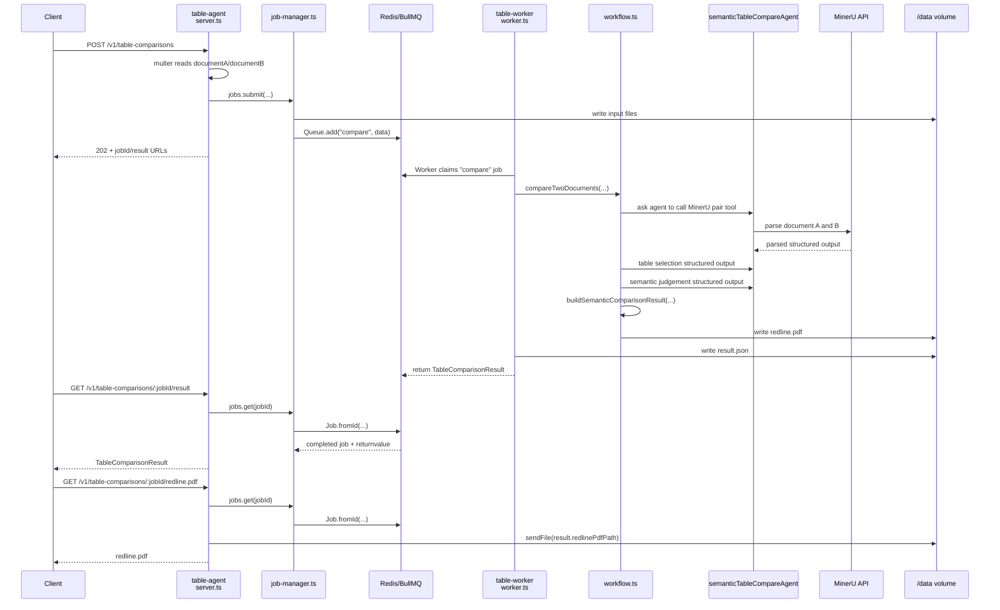

# Table Compare Request Walkthrough

This walks through one complete `POST /v1/table-comparisons` request in the current Redis/BullMQ architecture.

The important mental model:

- `table-agent` is the HTTP API container.
- `table-worker` is the BullMQ consumer container.
- `redis` stores BullMQ queue/job state.
- `./data` stores uploaded documents and generated artifacts.
- `mineru` does GPU document parsing.

## Runtime Containers

`docker-compose.yml` defines the relevant services:

- `redis` at `docker-compose.yml:2`: Redis for BullMQ queue state.
- `mineru` at `docker-compose.yml:13`: GPU MinerU API.
- `api` at `docker-compose.yml:40`: older/general parse API on `8080`; not the table-compare API.
- `table-agent` at `docker-compose.yml:62`: table-compare HTTP API on `8090`.
- `table-worker` at `docker-compose.yml:91`: background BullMQ worker.
- `gotenberg` at `docker-compose.yml:118`: fixture/test rendering service.

`table-agent` and `table-worker` use the same image, but start different processes:

- `table-agent` uses the Dockerfile default and runs `npm run dev:table-agent`, which starts `src/table-compare/server.ts`.
- `table-worker` overrides `command` at `docker-compose.yml:102` and runs `npm run worker:table-agent`, which starts `src/table-compare/worker.ts`.

Both mount `./data:/data`, so the API can save uploaded files and the worker can read them.

## End-To-End Diagram



## 1. API Container Starts

`table-agent` starts `src/table-compare/server.ts`.

At startup, `server.ts` initializes:

- `TABLE_COMPARE_PORT`, default `8090`, at `server.ts:10`;
- `TABLE_COMPARE_STORAGE_ROOT`, default `/data`, at `server.ts:11`;
- `MINERU_BASE_URL` at `server.ts:12`;
- `TABLE_COMPARE_WORKER_CONCURRENCY` for health reporting at `server.ts:13`;
- `multer` upload handling at `server.ts:14`;
- `MinerUClient` for `/health` at `server.ts:16`;
- `TableCompareJobManager` at `server.ts:20`;
- Express routes and Swagger UI.

The HTTP server starts at `server.ts:131`.

## 2. Worker Container Starts

`table-worker` starts `src/table-compare/worker.ts`.

The worker reads concurrency at `worker.ts:11`:

```ts
const concurrency = Number(process.env.TABLE_COMPARE_WORKER_CONCURRENCY ?? process.env.WORKER_CONCURRENCY ?? 2);
```

Then it creates the BullMQ worker at `worker.ts:13`:

```ts
new Worker(queueName(), async (job) => { ... }, {
  connection: redisConnectionOptions(),
  concurrency,
});
```

That line is where the worker begins reading jobs from Redis. BullMQ handles Redis polling, locking, claiming, retries, and completion state internally.

## 3. Redis Connection Settings

Both the API and worker share `src/table-compare/queue.ts`.

`queueName()` at `queue.ts:3` returns:

```text
TABLE_COMPARE_QUEUE_NAME or "table-comparisons"
```

`redisConnectionOptions()` at `queue.ts:7` returns:

```text
REDIS_URL or redis://127.0.0.1:6379
```

Inside Docker Compose, both `table-agent` and `table-worker` receive:

```text
REDIS_URL=redis://redis:6379
```

from `docker-compose.yml:75` and `docker-compose.yml:105`.

## 4. Client Submits A Job

The request hits `POST /v1/table-comparisons`, defined at `server.ts:52`.

The route:

1. Uses `multer` to read `documentA` and `documentB`, configured at `server.ts:54`.
2. Extracts those files from `request.files` at `server.ts:60`.
3. Validates both files exist at `server.ts:63`.
4. Parses optional `baselineDocument` at `server.ts:67`.
5. Calls `jobs.submit(...)` at `server.ts:73`.
6. Returns `202` with job URLs at `server.ts:74`.

Nothing in this request runs MinerU or the LLM. The API just stores files and queues work.

## 5. Job Manager Persists Uploads And Enqueues Work

`TableCompareJobManager.submit(...)` starts at `job-manager.ts:47`.

It does the durable setup:

1. Creates a job id at `job-manager.ts:52`.
2. Builds input/output directories at `job-manager.ts:54`.

   ```text
   /data/table-compare/jobs/<job_id>/input/
   /data/table-compare/jobs/<job_id>/output/
   ```

3. Writes uploaded files at `job-manager.ts:58` through `job-manager.ts:60`.
4. Builds the BullMQ payload `TableCompareJobData` at `job-manager.ts:62`.
5. Enqueues the job at `job-manager.ts:77`:

   ```ts
   this.queue.add("compare", data, { jobId: id })
   ```

That `queue.add(...)` call writes the job into Redis/BullMQ.

The API returns the job immediately after this. At this point the job may still be `queued`, or a worker may already have claimed it.

## 6. Worker Claims The Job

The BullMQ worker processor is the callback starting at `worker.ts:15`.

When Redis/BullMQ gives the worker a job, the worker:

1. Updates progress at `worker.ts:16`.
2. Ensures the output directory exists at `worker.ts:17`.
3. Calls `compareTwoDocuments(...)` at `worker.ts:19`.

The arguments passed to `compareTwoDocuments(...)` are the file paths and output directory that the API wrote into the Redis job payload:

- `documentAPath`: `worker.ts:20`
- `documentBPath`: `worker.ts:21`
- `outputDirectory`: `worker.ts:22`
- `baselineDocument`: `worker.ts:23`

## 7. Workflow Runs The Agent/MinerU Pipeline

`compareTwoDocuments(...)` is defined at `workflow.ts:36`.

It performs the full comparison:

1. Loads `semanticTableCompareAgent` from Mastra at `workflow.ts:37`.
2. Parses both documents with MinerU via the agent/tool path at `workflow.ts:39`.
3. Selects the comparable table sections at `workflow.ts:47`.
4. Applies the selected rows/tables at `workflow.ts:48` and `workflow.ts:49`.
5. Builds the semantic comparison prompt at `workflow.ts:50`.
6. Runs structured semantic judgement at `workflow.ts:51`.
7. Converts the semantic plan into a `TableComparisonResult` at `workflow.ts:52`.
8. Creates the redline PDF at `workflow.ts:54`.
9. Returns the completed result at `workflow.ts:61`.

## 8. Agent Calls MinerU

`parseDocumentsWithSemanticAgent(...)` starts at `workflow.ts:102`.

This function explicitly instructs the Mastra agent to call the MinerU pair tool. The prompt includes exact file paths at `workflow.ts:114` through `workflow.ts:120`.

The active tool is restricted at `workflow.ts:126`:

```ts
activeTools: [PARSE_PAIR_TOOL_KEY]
```

The tool itself is `parseDocumentPairTablesTool` in `src/mastra/tools/mineru-table-tools.ts`.

Important lines:

- `parseDocumentTables(...)` calls `client.parseDocument(...)` at `mineru-table-tools.ts:34`.
- Parsed MinerU output is converted to table structures at `mineru-table-tools.ts:37`.
- PDF table geometry is refined at `mineru-table-tools.ts:35`.
- Pair parsing runs both documents concurrently via `Promise.all(...)` at `mineru-table-tools.ts:44`.
- The Mastra tool declaration starts at `mineru-table-tools.ts:87`.

## 9. Semantic Judgement And Cleanup

The selection prompt is built by `buildTableSelectionPrompt(...)` in `semantic-compare.ts:76`.

The structured comparison schema is declared at `semantic-compare.ts:14`. It requires:

- `different`
- `summary`
- `explanation`
- `differences`
- optional `rowMatches`
- optional `ignored`

`buildSemanticComparisonResult(...)` starts at `semantic-compare.ts:464`.

This function:

1. Indexes cells by ref at `semantic-compare.ts:471` and `semantic-compare.ts:472`.
2. Filters deterministic template-only differences at `semantic-compare.ts:473`.
3. Builds reportable `TableDifference` objects at `semantic-compare.ts:480`.
4. Sets the final API `different` boolean at `semantic-compare.ts:479`.
5. Preserves ignored refs and matched rows in `semantic` metadata at `semantic-compare.ts:499`.

Template-noise cleanup starts at `semantic-compare.ts:520`.

It ignores:

- blank/padding row differences via `isBlankPaddingRowDifference(...)` at `semantic-compare.ts:542`;
- one-sided computed total/subtotal rows via `isOneSidedComputedSummaryRowDifference(...)` at `semantic-compare.ts:559`;
- generic optional remarks/notes/comments via `isOptionalTemplateFieldDifference(...)` at `semantic-compare.ts:574`.

This cleanup happens after the agent returns a structured plan. The agent still does semantic row/column matching, but deterministic code prevents known template artifacts from becoming false positives.

## 10. Redline PDF Is Written

`createRedlinePdf(...)` starts at `redline.ts:8`.

It:

1. Loads the selected baseline document at `redline.ts:16`.
2. Uses only the baseline document's bboxes at `redline.ts:20` through `redline.ts:28`.
3. Draws red boxes for each reportable difference at `redline.ts:31`.
4. Draws small numbered badges at `redline.ts:42`.
5. Writes the output PDF at `redline.ts:72`.

The output path is:

```text
/data/table-compare/jobs/<job_id>/output/redline.pdf
```

because `workflow.ts:57` passes `path.join(input.outputDirectory, "redline.pdf")`.

## 11. Worker Stores Result

After `compareTwoDocuments(...)` returns, `worker.ts` writes a filesystem copy of the result at `worker.ts:26`:

```text
/data/table-compare/jobs/<job_id>/output/result.json
```

Then the worker returns the result at `worker.ts:27`.

BullMQ stores that return value in Redis as the completed job result. This is what the API later reads for `GET /result`.

## 12. Client Polls Job Status

`GET /v1/table-comparisons/:jobId` is defined at `server.ts:88`.

It calls `jobs.get(jobId)` at `server.ts:89`.

`jobs.get(...)` is defined at `job-manager.ts:81`. It reads the BullMQ job from Redis using:

```ts
Job.fromId(...)
```

at `job-manager.ts:82`.

Then it calls `recordFromJob(...)`, which asks BullMQ for the job state at `job-manager.ts:114`.

State mapping happens in `mapBullState(...)` at `job-manager.ts:134`:

- `completed` -> `completed`
- `failed` -> `failed`
- `active` -> `processing`
- everything else -> `queued`

The API serializes the job response with `serializeJob(...)` at `server.ts:148`.

## 13. Client Fetches Result JSON

`GET /v1/table-comparisons/:jobId/result` is defined at `server.ts:97`.

It:

- returns `404` if Redis has no such job at `server.ts:99`;
- returns `202` if queued/processing at `server.ts:103`;
- returns `409` if failed at `server.ts:107`;
- returns `job.result` when completed at `server.ts:111`.

`job.result` comes from BullMQ `job.returnvalue`, assigned in `buildRecord(...)` at `job-manager.ts:130`.

## 14. Client Downloads Redline PDF

`GET /v1/table-comparisons/:jobId/redline.pdf` is defined at `server.ts:114`.

It:

- reads the job from Redis at `server.ts:115`;
- returns `202` until the job is completed and has a `redlinePdfPath` at `server.ts:120`;
- sends the generated PDF from disk at `server.ts:124`.

The PDF itself is not stored in Redis. Redis stores job metadata and the result object. The actual PDF lives on the shared `/data` volume.

## Responsibility Split

```text
table-agent container
  server.ts
  job-manager.ts
  queue.ts
  accepts HTTP
  writes uploads
  enqueues jobs
  reads job state/results from Redis
  serves redline PDFs from /data

table-worker container
  worker.ts
  queue.ts
  workflow.ts
  consumes jobs from Redis
  runs Mastra/MinerU comparison
  writes result.json and redline.pdf
  returns TableComparisonResult to BullMQ

redis container
  BullMQ queue state
  job state
  completed job return values

mineru container
  GPU document parsing

/data volume
  uploaded files
  geometry artifacts
  result.json
  redline.pdf
```

## What Happens If Something Fails

If the API cannot validate input, it returns `400` before enqueueing.

If the worker throws during parsing, agent calls, semantic comparison, or redline generation:

1. BullMQ marks the job failed.
2. `job.failedReason` is surfaced as `error` by `job-manager.ts:129`.
3. `/result` returns `409` at `server.ts:107`.
4. `/redline.pdf` returns `409` at `server.ts:120`.

If the API restarts while jobs are running, the jobs are not lost because the queue state is in Redis and files are on `/data`.

If the worker restarts, BullMQ/Redis remains the coordination point. New worker processes resume consuming the same queue.

## Current Scaling Shape

Right now the default Compose setup runs:

```text
1 table-agent container
1 table-worker container
1 redis container
1 mineru container
```

`table-worker` has internal concurrency from `TABLE_COMPARE_WORKER_CONCURRENCY`, currently defaulting to `4` in `docker-compose.yml:108`.

So the current shape is:

```text
one worker container
up to four jobs concurrently inside that worker process
```

Additional worker containers can be added later with:

```bash
docker compose up -d --scale table-worker=2
```

That would create multiple `table-worker` containers reading from the same Redis queue.
